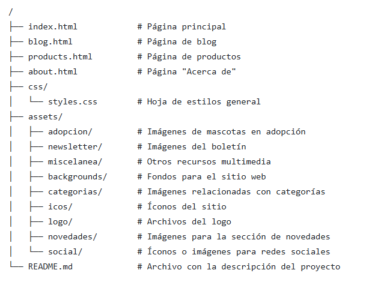

# daw1b-2425-lmysgi-falbmun0906-web2
Proyecto 2 - Desarrollo con Estándares Web - Francisco Alba Muñoz - 1º DAW-B

# Proyecto Web: Pawfect Store

Este proyecto representa una tienda online y plataforma para amantes de mascotas, desarrollada con el objetivo de proporcionar una experiencia de usuario clara, accesible y adaptativa. Incluye información sobre adopciones, servicios, contacto y registro para una comunidad exclusiva.

## 🐾 Descripción del Proyecto

El proyecto consiste en un sitio web de cuatro páginas interconectadas:
1. **Página principal**: Introducción y resumen del sitio.
2. **Página de productos**: Listado detallado de categorías disponibles.
3. **Página de 'Sobre nosotros'**: Ubicación de la empresa y FAQ.
4. **Página de blog**: Formulario para unirse a la comunidad y sección de adopciones.

Cada página está diseñada con HTML5 y CSS3, aplicando estándares modernos de maquetación, accesibilidad y diseño responsive.

---

## 🌟 Características Principales

- **Estructura semántica**: Uso de etiquetas como `<header>`, `<main>`, `<section>`, `<article>` para una organización clara del contenido.
- **Formulario funcional**: Incluye validación en campos requeridos, como correo, nombre, dirección y otros.
- **Diseño adaptable**: Implementación de media queries para garantizar una experiencia óptima en diferentes dispositivos.
- **Dark Mode**: Diseño básico con soporte para modo oscuro.
- **Animaciones y transiciones**: Mejora de la experiencia visual con efectos en botones, imágenes y menús.
- **Multimedia enriquecida**: Uso de imágenes optimizadas para ilustrar contenido.

---

## 📁 Estructura del Proyecto

El repositorio tiene la siguiente estructura:



---

## 🚀 Cómo Visualizar el Proyecto

1. **Clonar el repositorio**:
   ```bash
   git clone https://github.com/falbmun0906/daw1b-2425-lmysgi-falbmun0906-web2/
   ```
2. **Abrir el proyecto**:
   Navega a la carpeta descargada y abre el archivo `index.html` en tu navegador preferido.
3. **Navegación**:
   Utiliza el menú de navegación para explorar las diferentes páginas.

---

## 🛠️ Tecnologías Utilizadas

- **HTML5**: Estructura semántica y jerarquizada.
- **CSS3**: Estilos organizados bajo la metodología BEM.
- **Font Awesome**: Iconos para mejorar la interfaz.
- **Google Maps**: Integración para mostrar la ubicación del negocio.

---

## ✅ Validaciones Realizadas

- **HTML**: Código validado con [W3C Validator](https://validator.w3.org/) sin errores.
- **CSS**: Hoja de estilos revisada para cumplir con los estándares de calidad.
<p>
    <a href="http://jigsaw.w3.org/css-validator/check/referer">
        
    </a>
</p>

### Validación del Proyecto

#### Instrucciones de Validación

Para asegurar que el proyecto funcione correctamente, se siguieron los siguientes pasos de validación:

1. Validación del Código

a. Validación de HTML
El código HTML fue validado utilizando la herramienta [W3C HTML Validator](https://validator.w3.org/). Para ello, se realizó lo siguiente:
- Se copió el código HTML de los archivos y se verificó en el validador en línea.
- Se corrigieron los errores y advertencias que se detectaron durante la validación.

b. Validación de CSS
Se utilizó la herramienta [W3C CSS Validator](https://jigsaw.w3.org/css-validator/) para validar el código CSS:
- El código CSS se pegó en la herramienta.
- Se solucionaron los problemas encontrados, asegurando que el CSS cumple con los estándares.

2. Validación de Funcionalidad

a. Validación Manual
Se realizaron pruebas manuales en el proyecto para verificar su funcionalidad:
- Se probó la navegación, asegurándose de que todos los enlaces y botones funcionaran correctamente.
- Se comprobó que el diseño fuera responsivo y adecuado para diferentes tamaños de pantalla.
- Se validaron los formularios y las interacciones, asegurando que todos los datos se enviaran correctamente.

3. Validación de Accesibilidad

Se realizaron pruebas de accesibilidad utilizando [axe](https://www.deque.com/axe/) y [Lighthouse](https://developers.google.com/web/tools/lighthouse):
- Se verificó el contraste de color para asegurar que fuera adecuado para usuarios con discapacidades visuales.
- Se probó la navegación por teclado, garantizando que todos los elementos interactivos fueran accesibles sin mouse.

4. Validación de Desempeño

El rendimiento del proyecto fue validado con la herramienta [Google Lighthouse](https://developers.google.com/web/tools/lighthouse):
- Se revisaron aspectos como el tiempo de carga, el tamaño de los archivos, y la optimización de imágenes.
- Se validó el uso adecuado de caché para mejorar el desempeño.

#### Descripción de la Validación del Proyecto

El proyecto fue validado exhaustivamente mediante el uso de herramientas automáticas y pruebas manuales para asegurar su correcto funcionamiento, accesibilidad y rendimiento. Todos los problemas encontrados durante la validación fueron solucionados para garantizar una experiencia de usuario óptima y un código libre de errores.

---

## 🔍 Detalles Relevantes

- El formulario de registro incluye ocho campos validados: NIF/DNI, nombre, apellidos, dirección, código postal, localidad, país y correo electrónico.
- Cada página está diseñada para ser visualmente atractiva y fácilmente navegable.
- El proyecto está optimizado para tiempos de carga rápidos gracias al uso eficiente de recursos.

---

## Problemas encontrados: Utilización de SVG.

### 1. Introducción al problema
Cuando intentaba cargar el archivo SVG como fondo de la página mediante la propiedad background-image, la imagen no se mostraba y el navegador devolvía el error:
Failed to load resource: net::ERR_FILE_NOT_FOUND.

Esto indicaba que el archivo no estaba siendo encontrado en la ruta especificada.

### 2. Diagnóstico del problema
Después de revisar el código y la estructura de carpetas del proyecto, me di cuenta de que la ruta definida en el CSS:

```css
background-image: url(/css/sssurf.svg);
```

era incorrecta. El error estaba en que la ruta no correspondía a la ubicación real del archivo dentro de la jerarquía del proyecto.

El problema surge porque:

El prefijo / hace que el navegador busque la ruta desde la raíz del proyecto.
Esto no coincidía con la ubicación real del archivo en mi sistema de carpetas.

### 3. La solución aplicada
Revisé la estructura de archivos y ubiqué la carpeta y el archivo correctos. El archivo sssurf.svg estaba en ../assets/backgrounds/.
Cambié la ruta en el CSS a:

```css
background-image: url(../assets/backgrounds/sssurf.svg);
```

Esto resolvió el problema porque:

La ruta relativa ../ indica que debe subir un nivel desde la ubicación del archivo CSS.
El navegador pudo encontrar correctamente el archivo SVG y cargarlo como fondo.

# FASE 2: Manipulación del DOM con JavaScript

## Descripción  
Este proyecto muestra ejemplos prácticos de manipulación del DOM utilizando **JavaScript moderno** (ES6+). El código está organizado en funciones reutilizables para seleccionar, modificar, crear y eliminar elementos del DOM, además de aplicar estilos dinámicamente.  

### Lenguajes de script relacionados con la web:
JavaScript es el principal lenguaje de programación utilizado para la creación de aplicaciones web interactivas en el lado del cliente. Otros lenguajes de script como **HTML** y **CSS** se utilizan para estructurar el contenido y estilizar la apariencia de las páginas, pero es JavaScript el que permite la interacción dinámica con el usuario, como responder a eventos, manipular el contenido y el diseño de la página en tiempo real, y realizar tareas asincrónicas como las peticiones a servidores.

### Características clave de JavaScript moderno (ES6+):
Con la llegada de **ECMAScript 6 (ES6)**, también conocido como JavaScript moderno, se introdujeron varias mejoras en la sintaxis y funcionalidad del lenguaje. Estas actualizaciones incluyen características que simplifican el desarrollo, mejoran la legibilidad del código y permiten escribir aplicaciones más eficientes y fáciles de mantener.

#### Variables `let` y `const`:
Estas nuevas formas de declarar variables ayudan a gestionar mejor el alcance y la mutabilidad de las mismas. `let` se usa para declarar variables cuyo valor puede cambiar, mientras que `const` se utiliza para declarar valores constantes que no deben ser reasignados.

#### Funciones Flecha (`=>`):
Esta sintaxis de función más compacta reemplaza la palabra clave `function` y ofrece ventajas como la eliminación de la confusión con el contexto de `this`. Las **arrow functions** son especialmente útiles cuando se trabaja con funciones anónimas o callbacks.

#### Template Literals:
La interpolación de cadenas con las **template literals** permite incorporar variables directamente dentro de cadenas de texto sin necesidad de concatenarlas. Esto simplifica la construcción de strings complejos, mejorando la legibilidad y reduciendo la probabilidad de errores.

### Razón para usar sintaxis moderna (ES6+):
El uso de la sintaxis moderna de JavaScript, como las funciones flecha y las nuevas formas de declarar variables, tiene varios beneficios. Facilita la escritura de código más limpio y conciso, reduce la posibilidad de errores comunes, y permite una mayor claridad al gestionar el contexto de `this` dentro de las funciones. Además, la utilización de plantillas literales mejora la manipulación de cadenas de texto al permitir una inclusión más intuitiva de valores dentro de ellas.

JavaScript moderno (ES6+) no solo mejora la eficiencia del desarrollo, sino que también hace que el código sea más fácil de leer, mantener y escalar, lo que es esencial para aplicaciones web interactivas y dinámicas.

## Funcionalidades  

### 1. Seleccionar y acceder a elementos del DOM  

La función **`selectElements`** demuestra cómo acceder a elementos del DOM mediante distintos métodos:  

https://github.com/falbmun0906/daw1b-2425-lmysgi-falbmun0906-web2/blob/5f418ced930f07b7ff1089dda3b7ae96768d37c2/js/script.js#L7-L25

**Métodos utilizados:**  
- `getElementById()`  
- `getElementsByClassName()`  
- `querySelector()`  
- `querySelectorAll()`  

### 2. Crear y añadir elementos dinámicamente  

La función **`addJoinButton`** crea un nuevo botón y lo añade al contenedor de la newsletter:  

https://github.com/falbmun0906/daw1b-2425-lmysgi-falbmun0906-web2/blob/5f418ced930f07b7ff1089dda3b7ae96768d37c2/js/script.js#L31-L46

**Métodos utilizados:**  
- `document.createElement()` — Crea un nuevo elemento.  
- `element.appendChild()` — Añade el elemento creado como hijo del contenedor.  
- `classList.add()` — Añade clases CSS dinámicamente.  

### 3. Modificar contenido y atributos de elementos existentes  

La función **`modifyContentAndAttributes`** cambia el texto del título de la newsletter y actualiza el placeholder del campo de email:  

https://github.com/falbmun0906/daw1b-2425-lmysgi-falbmun0906-web2/blob/5f418ced930f07b7ff1089dda3b7ae96768d37c2/js/script.js#L52-L68

**Métodos utilizados:**  
- `textContent` — Modifica el contenido de texto de un elemento.  
- `setAttribute()` — Cambia atributos de un elemento (como el placeholder).  

### 4. Eliminar elementos del DOM  

La función **`removeFirstFAQ`** elimina el primer elemento FAQ, validando que el contenedor y el ítem existan:  

https://github.com/falbmun0906/daw1b-2425-lmysgi-falbmun0906-web2/blob/5f418ced930f07b7ff1089dda3b7ae96768d37c2/js/script.js#L74-L91

**Métodos utilizados:**  
- `querySelector()` — Seleccionar elementos.  
- `remove()` — Elimina directamente un elemento del DOM.  
- `contains()` — Verifica si un elemento contiene otro (para evitar errores).  

### 5. Manipular estilos dinámicamente  

# 5. Activar y Desactivar el Modo Oscuro/Claro

La funcionalidad de **modo oscuro** y **modo claro** permite al usuario alternar entre diferentes esquemas de colores en la página, activando un fondo oscuro o claro según la preferencia. Estas funciones modifican propiedades CSS directamente y cambian íconos, creando una experiencia visual dinámica.

**Código:**  

https://github.com/falbmun0906/daw1b-2425-lmysgi-falbmun0906-web2/blob/0fa2937d287008b319f12563eb5e2f3cf72e3913/js/script.js#L98-L150

### Función **`activateDarkMode`**

Esta función activa el modo oscuro en la página. Cambia los colores del esquema general de la interfaz, el fondo de la página y el encabezado, así como el ícono en el interruptor de modo oscuro (de sol a luna).

**Métodos utilizados:**

- `style.setProperty()` — Modifica las propiedades CSS dinámicamente.
- `classList.add()` y `classList.remove()` — Cambia las clases del ícono para actualizar la imagen del sol a la luna.

**Comportamiento:**

1. **Esquema de colores:**  
   Ajusta los valores de las variables CSS del `:root` para aplicar un esquema de colores más oscuro.

2. **Fondo de la página:**  
   Cambia la imagen de fondo del `body` y el encabezado a una versión más oscura.

3. **Ícono del interruptor:**  
   Cambia el ícono de modo oscuro del sol a la luna (iconos `fa-sun` a `fa-moon`).

https://github.com/falbmun0906/daw1b-2425-lmysgi-falbmun0906-web2/blob/0fa2937d287008b319f12563eb5e2f3cf72e3913/js/script.js#L98-L117

### Función **`activateLightMode`**

Esta función restaura el modo claro. Restaura el esquema de colores, los fondos de la página y del encabezado, y cambia el ícono del interruptor de luna a sol.

**Métodos utilizados:**

- `style.setProperty()` — Modifica las propiedades CSS dinámicamente.
- `classList.add()` y `classList.remove()` — Cambia las clases del ícono para actualizar la imagen de la luna al sol.

**Comportamiento:**

1. **Esquema de colores:**  
   Restaura las variables CSS del `:root` a colores más claros.

2. **Fondo de la página:**  
   Restaura las imágenes de fondo del `body` y el encabezado a las versiones originales (más claras).

3. **Ícono del interruptor:**  
   Cambia el ícono de modo oscuro de la luna al sol (iconos `fa-moon` a `fa-sun`).

https://github.com/falbmun0906/daw1b-2425-lmysgi-falbmun0906-web2/blob/0fa2937d287008b319f12563eb5e2f3cf72e3913/js/script.js#L120-L139

### Función **`darkModeToggle.addEventListener('change')`**

Esta función se activa cuando el interruptor de modo oscuro (checkbox) cambia de estado (es decir, cuando el usuario lo marca o desmarca). Dependiendo del estado del interruptor, se activa el modo oscuro o el modo claro.

**Métodos utilizados:**

- `addEventListener()` — Escucha el evento de cambio (`change`) en el interruptor de modo oscuro.
- **Condicionales** — Cambia entre los modos llamando a `activateDarkMode()` o `activateLightMode()`.

**Comportamiento:**

1. **Modo oscuro activado:**  
   Si el interruptor está marcado, se activa el modo oscuro.

2. **Modo claro activado:**  
   Si el interruptor no está marcado, se activa el modo claro.

https://github.com/falbmun0906/daw1b-2425-lmysgi-falbmun0906-web2/blob/0fa2937d287008b319f12563eb5e2f3cf72e3913/js/script.js#L142-L150

# FASE 3: Funcionalidades Interactivas.

### 1. Función **`thumbnail.addEventListener('click')`**

Esta función se activa cuando el usuario hace clic en una miniatura de imagen (`.gallery__thumbnail`) dentro de un producto destacado. Permite **cambiar dinámicamente la imagen principal del producto** sin recargar la página.

**Métodos utilizados:**

- `querySelectorAll()` — Selecciona todos los productos (`.product`) y, dentro de cada uno, sus miniaturas.
- `addEventListener('click')` — Añade un evento a cada miniatura para detectar cuándo el usuario hace clic.
- **Manipulación del DOM** — Se cambia el atributo `src` de la imagen principal (`.product__image`) para actualizarla con la imagen seleccionada.

**Modificaciones en HTML**

Para implementar la funcionalidad de cambiar la imagen principal del producto al hacer clic en una miniatura, ha sido necesario añadir al documento HTML un conjunto de miniaturas por cada producto destacado. Al hacer clic en cualquiera de las miniaturas, la imagen principal se actualiza dinámicamente sin recargar la página.

```html
<article class="featured__item product">
        
        <p class="product__rating">
            <i class="fas fa-paw"></i>
            <i class="fas fa-paw"></i>
            <i class="fas fa-paw"></i>
            <i class="fas fa-paw"></i>

            <span class="product__rating-score">(4.2)</span>
            <span class="product__rating-reviews">17</span>
        </p>
        <a class="product__name" href="#">Parka reversible - Lila / Verde</a>
        <p class="product__price">69,95 €</p>
        <button class="product__cart-button" title="Añadir al carrito">
            <i class="fas fa-shopping-cart"></i>
        </button>


        <div class="product__gallery">
            
            
            
        </div>
</article>
```

**Comportamiento:**

1. **El usuario ve un producto con varias miniaturas debajo.**  
   Cada miniatura representa una vista distinta del producto.

2. **El usuario hace clic en una miniatura.**  
   Se actualiza la imagen principal del producto con la imagen de esa miniatura.

3. **La experiencia de compra es más rica e interactiva.**  
   El cliente puede ver el producto desde distintos ángulos o en distintos colores.

**Fragmento relevante del código:**

```js
document.addEventListener('DOMContentLoaded', () => {
    const products = document.querySelectorAll('.product');

    products.forEach(product => {
        const thumbnails = product.querySelectorAll('.gallery__thumbnail');
        const mainImage = product.querySelector('.product__image');

        thumbnails.forEach(thumbnail => {
            thumbnail.addEventListener('click', () => {
                mainImage.src = thumbnail.src;
            });
        });
    });
});
```

### 2. Función **`Formulario con validación dinámica y mensajes de error o éxito`**

Esta función gestiona la validación dinámica de un formulario en una página web, mostrando mensajes de error o éxito según la interacción del usuario. Cuando el formulario se envía, se verifica que todos los campos sean correctos, mostrando los mensajes apropiados sin necesidad de recargar la página.

**Métodos utilizados:**

- `addEventListener('submit')`: Añade un evento al formulario para escuchar cuando se intente enviar.
- `preventDefault()`: Evita el envío convencional del formulario y recarga de la página.
- `querySelectorAll()`: Selecciona todos los campos del formulario que se desean validar.
- `classList.add()` y `classList.remove()`: Añade o elimina clases CSS de los campos para resaltar errores de validación.
- `textContent`: Modifica el texto del contenedor para mostrar mensajes de error o éxito.
- `focus()`: Coloca el foco en el primer campo inválido, mejorando la experiencia del usuario.

**Modificaciones en HTML**

Para implementar la funcionalidad de validación y mostrar mensajes de error o éxito, se añadió un contenedor para los mensajes de validación (por ejemplo, "¡Registro exitoso!" o "Por favor, complete todos los campos correctamente."):

```html
<div class="main__community__container">
            <section class="main__community__form-container">
            <form action="#" method="post">
                <ul class="main__community__form-list">
                    <li class="main__community__form-item">
                        <label for="dni"><i class="icon fa-solid fa-id-card"></i></label>
                        <input type="text" id="dni" name="dni" placeholder="NIF/DNI">
                    </li>
                    <li class="main__community__form-item">
                        <label for="first-name"><i class="icon fa-solid fa-user"></i></label>
                        <input type="text" id="first-name" name="first-name" placeholder="Nombre">
                    </li>
                    <li class="main__community__form-item">
                        <label for="last-name"><i class="icon fa-solid fa-signature"></i></label>
                        <input type="text" id="last-name" name="last-name" placeholder="Apellidos">
                    </li>
                    <li class="main__community__form-item">
                        <label for="address"><i class="icon fa-solid fa-location-dot"></i></label>
                        <input type="text" id="address" name="address" placeholder="Dirección">
                    </li>
                    <li class="main__community__form-item">
                        <label for="postal-code"><i class="icon fa-solid fa-envelopes-bulk"></i></label>
                        <input type="text" id="postal-code" name="postal-code" placeholder="Código postal">
                    </li>
                    <li class="main__community__form-item">
                        <label for="locality"><i class="icon fa-solid fa-city"></i></label>
                        <input type="text" id="locality" name="locality" placeholder="Localidad">
                    </li>
                    <li class="main__community__form-item">
                        <label for="country"><i class="icon fa-solid fa-globe"></i></label>
                        <input type="text" id="country" name="country" placeholder="País">
                    </li>
                    <li class="main__community__form-item">
                        <label for="email"><i class="icon fa-solid fa-envelope"></i></label>
                        <input type="email" id="email" name="email" placeholder="Dirección e-mail">
                    </li>
                    <li class="main__community__form-item full-width">
                        <div id="form-message" class="form-message"></div>
                    </li>
                    <li class="main__community__form-options">
                        <button class="main__community__form-button" type="submit">Registrarse</button>
                    </li>
                </ul>
            </form>
            </section>
            <section class="main__community__portrait">
            
            </section>
        </div>
```

**Comportamiento:**

1. **El formulario es enviado:**  
   Al hacer clic en el botón de envío, se activa la función de validación que verifica si los campos requeridos son correctos.

2. **Validación de los campos:**  
   La función recorre todos los campos requeridos del formulario y verifica si están vacíos o si el correo electrónico ingresado es inválido. Si algún campo no cumple con los requisitos, se resalta en rojo y el proceso de envío se detiene.

3. **Mensajes de error o éxito:**  
   Si todos los campos son correctos, se muestra un mensaje de éxito ("¡Registro exitoso!"), y el formulario se reinicia. Si algún campo es inválido, se muestra un mensaje de error en el contenedor de mensajes y se resalta el campo problemático.

4. **Interacción fluida:**  
   Los mensajes de error o éxito se actualizan de forma dinámica sin necesidad de recargar la página, y el usuario puede corregir fácilmente los errores al ser guiado visualmente.

**Fragmento relevante del código:**

```js
document.addEventListener('DOMContentLoaded', () => {
  const form = document.querySelector('.main__community__form-container form');
  const inputs = form.querySelectorAll('input');
  const messageContainer = document.getElementById('form-message');

  form.addEventListener('submit', (e) => {
    e.preventDefault(); // Previene el envío por defecto

    let isValid = true;
    let firstInvalidInput = null;

    // Limpia los mensajes anteriores
    messageContainer.textContent = '';
    messageContainer.className = 'form-message'; // Asegura que no haya clases previas

    // Recorre todos los campos de entrada
    inputs.forEach(input => {
      input.classList.remove('input-error'); // Elimina los estilos de error previos

      // Validación personalizada para cada campo
      if (!input.value.trim()) {
        isValid = false;
        input.classList.add('input-error'); // Añade el estilo de error
        if (!firstInvalidInput) firstInvalidInput = input;
        setErrorMessage('Por favor, completa todos los campos correctamente.');
      } else {
        switch (input.id) {
          case 'dni':
            if (!validateDNI(input.value)) {
              isValid = false;
              input.classList.add('input-error');
              if (!firstInvalidInput) firstInvalidInput = input;
              setErrorMessage('El DNI debe tener el siguiente formato: 12345678A');
            }
            break;
          case 'first-name':
          case 'last-name':
          case 'locality':
          case 'country':
            if (!validateLetters(input.value)) {
              isValid = false;
              input.classList.add('input-error');
              if (!firstInvalidInput) firstInvalidInput = input;
              setErrorMessage('Este campo solo puede contener letras.');
            }
            break;
          case 'postal-code':
            if (!validatePostalCode(input.value)) {
              isValid = false;
              input.classList.add('input-error');
              if (!firstInvalidInput) firstInvalidInput = input;
              setErrorMessage('El código postal debe tener 5 dígitos.');
            }
            break;
          case 'email':
            if (!validateEmail(input.value)) {
              isValid = false;
              input.classList.add('input-error');
              if (!firstInvalidInput) firstInvalidInput = input;
              setErrorMessage('Por favor, introduce una dirección de correo válida.');
            }
            break;
          default:
            break;
        }
      }
    });

    if (isValid) {
      messageContainer.textContent = '¡Registro exitoso!';
      messageContainer.classList.add('success');
      form.reset();
    }

    if (firstInvalidInput) {
      firstInvalidInput.focus();
    }
  });

  // Función para establecer el mensaje de error en el contenedor #form-message
  function setErrorMessage(message) {
    messageContainer.textContent = message;
    messageContainer.classList.add('error');
  }

  // Función de validación para el DNI
  function validateDNI(dni) {
    const dniRegex = /^\d{8}[A-Za-z]$/;
    return dniRegex.test(dni);
  }

  // Función de validación para solo letras (primer nombre, apellido, etc.)
  function validateLetters(value) {
    return /^[a-zA-ZáéíóúÁÉÍÓÚñÑ]+$/.test(value);
  }

  // Función de validación para el código postal (5 dígitos)
  function validatePostalCode(postalCode) {
    return /^\d{5}$/.test(postalCode);
  }

  // Función de validación para el correo electrónico
  function validateEmail(email) {
    const emailRegex = /^[^\s@]+@[^\s@]+\.[^\s@]+$/;
    return emailRegex.test(email);
  }
});
```

**Nuevas validaciones y cambios en HTML:**

1. **Eliminación de `required` en los campos del formulario.**  
   Se eliminan los atributos `required` de los campos en el HTML, permitiendo que la validación y los mensajes de error se gestionen completamente con JavaScript.

2. **Contenedor para el mensaje de validación.**  
   Se ha añadido el `div` con el ID `form-message` para mostrar el mensaje de error o éxito de forma centralizada y dinámica.

Este enfoque proporciona una experiencia de usuario más fluida y controlada, guiando al usuario para corregir sus errores de manera eficiente sin recargar la página.


### 3. Función **`Filtrado de perros de adopción con mensaje de "No se han encontrado coincidencias"`**

Esta función gestiona el filtrado dinámico de una lista de perros en adopción según los criterios seleccionados por el usuario. Cuando el formulario de filtros es enviado, se verifican los criterios de búsqueda y se muestran u ocultan los perros según las opciones seleccionadas. Si no hay resultados que coincidan con los filtros, se muestra un mensaje indicando que no se encontraron coincidencias.

**Métodos utilizados:**

- `addEventListener('submit')` — Añade un evento al formulario para escuchar cuando se intente enviar.
- `preventDefault()` — Evita que la página se recargue cuando el formulario es enviado.
- `querySelectorAll()` — Selecciona todos los perros de la lista para poder aplicar el filtrado.
- `textContent` — Modifica el texto de un contenedor para mostrar el mensaje "No se han encontrado coincidencias".
- `style.display` — Controla la visibilidad de los perros y el mensaje de error, mostrándolos u ocultándolos según corresponda.

**Modificaciones en HTML**

Para implementar la funcionalidad de filtrado de perros de adopción en la página, ha sido necesario añadir al documento HTML una sección de filtros con un formulario interactivo. Este formulario permite a los usuarios seleccionar criterios específicos para filtrar los perros en adopción. Los filtros incluyen opciones para la raza, el tamaño, el nivel de actividad y la edad del perro.

```html
<section class="main__adoption__filters">
       <form id="adoption-filters">
           <select id="breed">
               <option value="all" selected>Raza</option>
               <option value="labrador">Labrador Retriever</option>
               <option value="border-collie">Border Collie</option>
               <option value="galgo-italiano">Galgo Italiano</option>
           </select>
       
           <select id="size">
               <option value="all" selected>Tamaño</option>
               <option value="grande">Grande</option>
               <option value="mediano">Mediano</option>
               <option value="pequeño">Pequeño</option>
           </select>
       
           <select id="activity">
               <option value="all" selected>Nivel de actividad</option>
               <option value="alto">Alto</option>
               <option value="moderado">Moderado</option>
               <option value="bajo">Bajo</option>
           </select>
   
           <select id="age">
               <option value="all" selected>Edad</option>
               <option value="1">1 año</option>
               <option value="4">4 años</option>
           </select>
       
           <button type="submit">Filtrar</button>
       </form>
</section>
```

**Comportamiento:**

1. **El formulario es enviado.**  
   Cuando el usuario hace clic en el botón de "Filtrar", la función de filtrado es activada para verificar los criterios seleccionados y procesar la lista de perros.

2. **Filtrado de los perros.**  
   La función recorre todos los perros en la página y verifica si coinciden con los filtros seleccionados para la raza, tamaño, nivel de actividad y edad. Si un perro no cumple con los criterios, se oculta; si cumple, se muestra.

3. **Mensaje de "No se han encontrado coincidencias".**  
   Si no hay perros que coincidan con los filtros, se muestra un mensaje debajo del formulario indicando que no se encontraron resultados.

4. **Interacción fluida.**  
   El filtrado se realiza de manera dinámica sin necesidad de recargar la página, y el usuario recibe un mensaje claro si no se encuentran coincidencias.

**Fragmento relevante del código:**

```js
document.addEventListener('DOMContentLoaded', () => {
    const form = document.getElementById('adoption-filters');
    const dogs = document.querySelectorAll('.main__adoption__card');
    const noResultsMessage = document.querySelector('.no-results-message'); // Usamos la clase aquí

    form.addEventListener('submit', (e) => {
        e.preventDefault(); // Evitar que la página se recargue

        const breed = document.getElementById('breed').value;
        const size = document.getElementById('size').value;
        const activity = document.getElementById('activity').value;
        const age = document.getElementById('age').value;

        let foundMatch = false; // Variable para saber si hay coincidencias

        dogs.forEach(dog => {
            const dogBreed = dog.querySelector('.main__adoption__breed').textContent.toLowerCase();
            const dogSize = dog.querySelector('.main__adoption__size').textContent.toLowerCase();
            const dogActivity = dog.querySelector('.main__adoption__activity').textContent.toLowerCase();
            const dogAge = dog.querySelector('.main__adoption__age').textContent.toLowerCase();

            // Comprobamos si el perro cumple con los filtros seleccionados
            const matchesBreed = breed === 'all' || dogBreed.includes(breed.replace('-', ' '));
            const matchesSize = size === 'all' || dogSize.includes(size);
            const matchesActivity = activity === 'all' || dogActivity.includes(activity);
            const matchesAge = age === 'all' || dogAge.includes(age);

            // Mostrar u ocultar el perro según si cumple con todos los filtros
            if (matchesBreed && matchesSize && matchesActivity && matchesAge) {
                dog.style.display = ''; // Mostrar el perro
                foundMatch = true; // Si encontramos una coincidencia, marcamos que sí se encontraron
            } else {
                dog.style.display = 'none'; // Ocultar el perro
            }
        });

        // Si no se encontró ninguna coincidencia, mostrar el mensaje
        if (!foundMatch) {
            noResultsMessage.style.display = 'block'; // Mostrar el mensaje
        } else {
            noResultsMessage.style.display = 'none'; // Ocultar el mensaje si hay resultados
        }
    });
});
```

### Ajuste realizado:

Se realizó un cambio para manejar correctamente los casos en los que el nombre de la raza contiene un guion, como "border-collie". El ajuste en el código se hizo reemplazando el guion (-) por un espacio (' ') antes de hacer la comparación en la línea:

```js
const matchesBreed = breed === 'all' || dogBreed.includes(breed.replace('-', ' '));
```

Este cambio tiene como objetivo hacer que la comparación entre las razas funcione sin problemas, incluso cuando la raza contiene un guion. Esto asegura que se comparen las cadenas de texto correctamente, y que si se selecciona "border collie" en el filtro, se muestren todos los perros de esa raza, ya sea con o sin guion en su nombre.

### 4. Función **`Gestión dinámica del carrito de compras con botones de eliminación individuales`**

Esta funcionalidad implementa un sistema de carrito de compras interactivo. Permite a los usuarios añadir productos desde tarjetas individuales, ver los productos en un dropdown dinámico y eliminarlos de forma individual con un botón `"X"`. Además, calcula el total de la compra y actualiza el contador de productos en tiempo real.

**Métodos utilizados**

- **addEventListener("DOMContentLoaded")** — Inicia la funcionalidad al cargar el DOM.  
- **addEventListener("click")** — Escucha eventos tanto para abrir/cerrar el carrito como para añadir o eliminar productos.  
- **stopPropagation()** — Evita que el clic sobre el botón del carrito cierre el dropdown.  
- **style.display** — Alterna la visibilidad del dropdown del carrito.  
- **querySelector() / querySelectorAll()** — Accede a elementos del DOM como botones, contenedores, nombres y precios de productos.  
- **createElement()** — Crea dinámicamente elementos de lista para los productos añadidos.  
- **innerHTML** — Inyecta contenido HTML para mostrar productos.  
- **textContent** — Muestra el total del carrito y la cantidad de productos.  
- **splice()** — Elimina un producto específico del array `cartItems`.  
- **closest()** — Encuentra el contenedor padre más cercano de un producto desde un botón de clic.

**Estructura HTML utilizada**

```html
<div class="header__cart">
  <button id="openCart" class="cart__toggle">
    <i class="fas fa-shopping-cart"></i>
    <span id="cartCount" class="cart__count">0</span>
  </button>

  <div id="cartDropdown" class="cart__dropdown">
    <h3 class="cart__title">Tu carrito</h3>
    <ul class="cart__items">
      <!-- Aquí se inyectan dinámicamente los productos -->
    </ul>
    <div class="cart__footer">
      <p class="cart__total">Total: <span id="cartTotal">0.00 €</span></p>
      <button class="cart__checkout-btn">Finalizar compra</button>
    </div>
  </div>
</div>
```

**Comportamiento general**

1. **Mostrar/ocultar carrito**  
   Al hacer clic en el botón del carrito (`#openCart`), el menú desplegable se alterna entre mostrar u ocultar (`#cartDropdown`). Si el usuario hace clic fuera del área del carrito, este se cierra automáticamente.

2. **Añadir productos al carrito**  
   Cada botón `.product__cart-button` extrae el nombre y precio de un producto desde su contenedor `.product`, y lo añade al array `cartItems`. Luego se actualiza la interfaz del carrito.

3. **Renderizado dinámico del carrito**  
   Por cada producto en `cartItems`, se crea un `<li>` con:
   - Nombre del producto  
   - Precio  
   - Botón para eliminar (`X`)  

4. **Eliminar productos individualmente**  
   Cada botón `"X"` elimina el producto correspondiente del array y vuelve a renderizar la lista.

5. **Cálculo del total y contador**  
   Se recalcula el total en euros de todos los productos del carrito y se actualiza el contador de productos visibles junto al icono del carrito.

**Fragmento relevante del código JavaScript**

```js
document.addEventListener("DOMContentLoaded", () => {
  const cartDropdown = document.getElementById("cartDropdown");
  const openCartButton = document.getElementById("openCart");
  const cartCount = document.getElementById("cartCount");
  const cartTotal = document.getElementById("cartTotal");
  const cartItemsContainer = document.querySelector(".cart__items");

  let cartItems = [];

  openCartButton.addEventListener("click", (e) => {
    e.stopPropagation();
    cartDropdown.style.display = cartDropdown.style.display === "block" ? "none" : "block";
  });

  document.addEventListener("click", (e) => {
    if (!cartDropdown.contains(e.target) && !openCartButton.contains(e.target)) {
      cartDropdown.style.display = "none";
    }
  });

  const addToCart = (productName, productPrice) => {
    cartItems.push({ name: productName, price: productPrice });
    updateCartUI();
  };

  const updateCartUI = () => {
    cartItemsContainer.innerHTML = "";

    cartItems.forEach((item, index) => {
      const cartItem = document.createElement("li");
      cartItem.classList.add("cart__item");

      cartItem.innerHTML = `
        <p>${item.name}</p>
        <p>${item.price}</p>
        <button class="cart__remove-btn" data-index="${index}">X</button>
      `;

      cartItemsContainer.appendChild(cartItem);
    });

    const removeButtons = document.querySelectorAll(".cart__remove-btn");
    removeButtons.forEach(button => {
      button.addEventListener("click", (e) => {
        const index = parseInt(e.target.dataset.index, 10);
        cartItems.splice(index, 1);
        updateCartUI();
      });
    });

    const total = cartItems.reduce((acc, item) => acc + parseFloat(item.price.replace(" €", "")), 0);
    cartTotal.textContent = `${total.toFixed(2)} €`;
    cartCount.textContent = cartItems.length;
  };

  const cartButtons = document.querySelectorAll(".product__cart-button");
  cartButtons.forEach(button => {
    button.addEventListener("click", (event) => {
      const product = event.target.closest(".product");
      const productName = product.querySelector(".product__name").textContent;
      const productPrice = product.querySelector(".product__price").textContent;
      addToCart(productName, productPrice);
    });
  });
});
```
